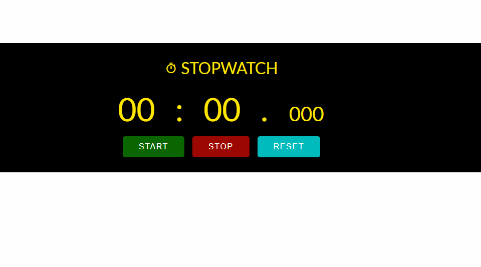

# Stopwatch

> A simple stopwatch with `start`, `stop` and `reset` functionalities.

## Table of contents

- [Stopwatch](#stopwatch)
  - [Table of contents](#table-of-contents)
  - [General info](#general-info)
  - [Screenshots](#screenshots)
  - [Technologies](#technologies)
  - [Setup](#setup)
  - [Code Examples](#code-examples)
  - [Status](#status)

## General info

> The objective of the project is to practice separation of concerns in
> JavaScript and use `setInterval` and `clearInterval` APIs.

## Screenshots



## Technologies

- JavaScript
- HTML5
- CSS3
- VS Code

## Setup

Clone the repo and run `npm` install.

## Code Examples

```js
const startHandler = () => {
	if (data.intervalId) {
		clearInterval(data.intervalId);
	}

	data.intervalId = setInterval(() => {
		const newData = updateTime(data);

		//update dom
		updateTimeComponent(dom.time, newData);
	}, 10);
};
```

## Status

Project is: _done_
